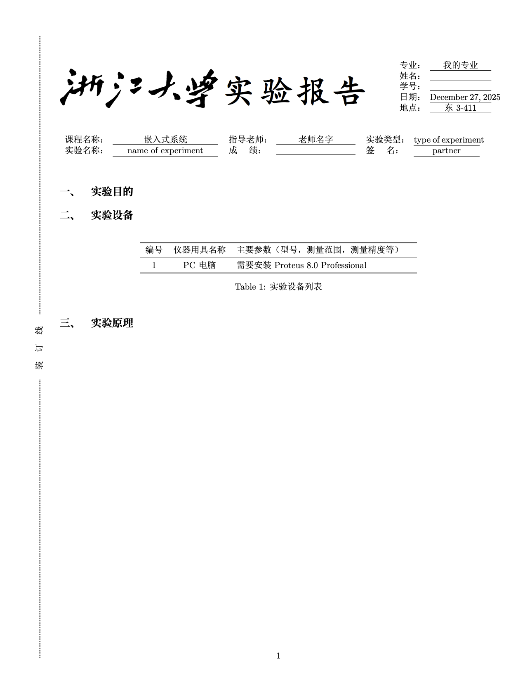
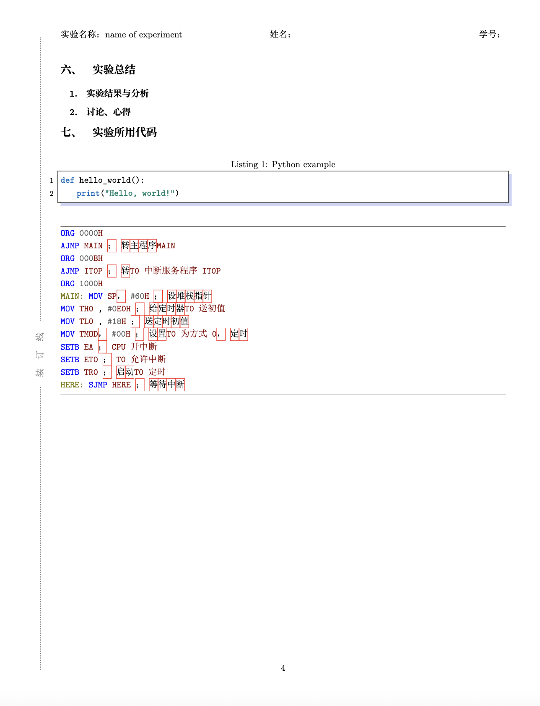

# 嵌入式系统实验




## 快速开始

### 编译

使用 Makefile 编译：

```bash
make
```

编译完成后，生成的 PDF 文件位于根目录的 `main.pdf`（同时也会保留在 `build/main.pdf`）。

其他常用命令：
- `make clean` - 清理 build 目录和 PDF 文件
- `make help` - 查看所有可用的 make 命令

### 手动编译

如果需要手动编译，使用以下命令：

```bash
xelatex -shell-escape -interaction=nonstopmode main.tex
xelatex -shell-escape -interaction=nonstopmode main.tex
```

**注意**：`-shell-escape` 选项是必需的，因为文档使用了 `minted` 包进行代码高亮。

## 参考模版

[98 模版 1](https://www.cc98.org/topic/5068412)
[Template By 雪松 Cedar](https://www.cc98.org/topic/5459476)
[图片排版方法](https://www.cc98.org/topic/5111533/1)

## 项目结构

```text
.
├── main.tex          # 主文件，包含实验报告内容
├── config.cls         # 文档类文件，存放页面设置等
├── picture.tex        # 多种插入图片方式的实例
├── Makefile          # 编译脚本
├── figures/          # 图片文件夹
│   ├── char.png
│   ├── cover.png
│   ├── example.jpg
│   ├── head.jpg
│   └── logo.png
├── simsun.ttc        # 中文字体文件
├── simsunBold.otf    # 中文字体文件（粗体）
├── build/            # 编译输出目录（自动生成）
│   └── main.pdf     # 生成的 PDF 文件
└── README.md         # 项目说明文档
```

## 文档目录

- `main.tex` 文件是实验报告部分
- `picture.tex` 是多种插入图片方式的实例
- `config.cls` 存放页面设置等

## 有用网站

[Latex 制作表格网站](https://www.tablesgenerator.com/)
